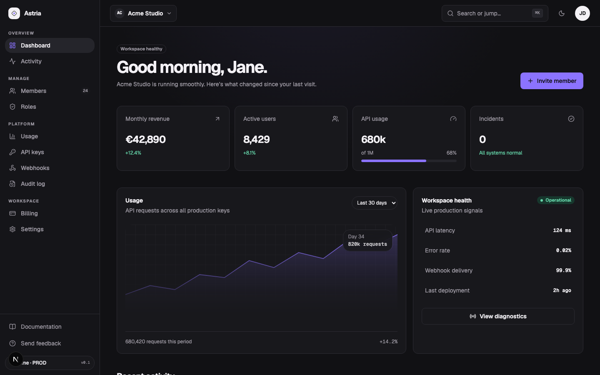

# Astria

A polished, provider-neutral multi-tenant SaaS starter built with Next.js, TypeScript, Tailwind CSS, and shadcn/ui conventions.



## Why Astria

- Multi-tenant app shell with persistent workspace context
- Dashboard, members, roles, usage, billing, audit log, and settings
- Demo data works immediately — no accounts or API keys required
- Swappable adapters for PostgreSQL/Prisma, Auth.js, Clerk, and Stripe
- Accessible command menu, dialogs, tables, loading states, empty states, and errors
- Light and dark themes with a documented design system

## Quick start

```bash
npm install
cp .env.example .env.local
npm run dev
```

Open [http://localhost:3000](http://localhost:3000). The default adapter set is `demo`.

## Adapter model

Astria keeps product code independent from providers. Configure each boundary separately:

```env
ASTRIA_DATABASE_ADAPTER=demo # demo | prisma
ASTRIA_AUTH_ADAPTER=demo     # demo | authjs | clerk
ASTRIA_BILLING_ADAPTER=demo  # demo | stripe
```

The adapter contracts live in `src/lib/adapters`. Replace a provider without rewriting your UI or tenancy rules.

## Production checklist

1. Configure PostgreSQL and run `npx prisma generate && npx prisma db push`.
2. Select Auth.js or Clerk and add the required environment variables.
3. Select Stripe and configure a webhook endpoint for subscription updates.
4. Replace demo authorization with your server-side policy checks.
5. Add rate limiting, email delivery, observability, and your deployment secrets.

## Architecture

```text
src/
├── app/                 Next.js App Router pages
├── components/          Product and shadcn-style UI components
└── lib/
    ├── adapters/        Provider-neutral boundaries and examples
    └── demo-data.ts     Instant local demo content
```

## Scripts

- `npm run dev` — local development
- `npm run build` — production build
- `npm run typecheck` — TypeScript validation
- `npm run lint` — ESLint

## License

MIT — use Astria for personal and commercial projects.
